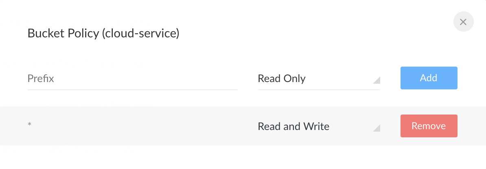

## 微服务Minio分布式文件系统部署：
### 1. Docker中安装Minio（单节点）
```
docker run -it --restart=always -p 9000:9000 --name minio1 -e "MINIO_ACCESS_KEY=cloud-service" -e "MINIO_SECRET_KEY=cloud-service" -v /tools/minio/cloud-service:/data  minio/minio server /data
```
注意：当前Minio部署在 192.168.11.162 服务器的Docker容器中

### 2. Minio相关配置
访问 ip:9000，配置bucket，用户名、密码均为cloud-service。新增名为cloud-service的bucket，并配置策略为可读写,如下图。


### 其他
Minio集群部署，请参考[Minio官网](https://docs.min.io/cn/)