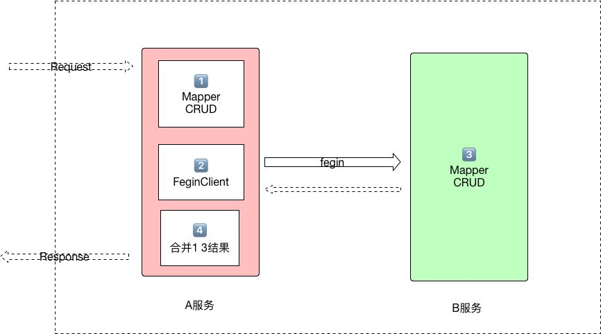

#### 什么是分布式事务？

>>如上图所示，当请求 A 模块时
>>1. A模块 Mapper 直接操作 DB 得到数据集 
>>2. 使用 Feign 调用 B 模块
>>3. B模块 Mapper 操作 DB 得到数据集
>>4. 合并1.3 两步操作或者其他的操作  

分上图可能发生异常及其回滚：  
- 步骤1 发生异常， spring 事务会自动回滚
- 步骤2 发生异常， spring 事务会自动回滚
- 步骤3 发生异常， 3会自动回滚， 2根据返回码抛出自定义异常 1会自动回滚
- 步骤4 发生异常， spring 事务会自动1 的操作 ，但是3的操作不会回滚

分布式事务的目标 当A模块开启事务时，如果4 操作过程异常，3的操作应该回滚。  

微服务中心基于 LCN4.1 实现分布式事务，事务操作和代码耦合度极低，支持注册中心的事务发现和自动管理，用法完全兼容LCN。


#### 开发步骤
1). 启动 tx-manager 事务协调模块

2). A/B 模块引入事务管理依赖
```
<dependency>
    <groupId>com.cloud</groupId>
    <artifactId>lcn-transaction-starter</artifactId>
    <version>${project.version}</version>
</dependency>
```

3). A模块 Service 开启事务
- 注意：这里A作为 Feign 的发起方 这里 isStart = true 来声明是事务的发起方
```
@TxTransaction(isStart = true)
@Transactional(rollbackFor = Exception.class)
public Object save() {
    ...
}
```
4). B模块的 Service 同样开启事务
```
@TxTransaction
@Transactional(rollbackFor = Exception.class)
public Object save() {
    ...
}
```
这样就完成了分布式事务的接入。